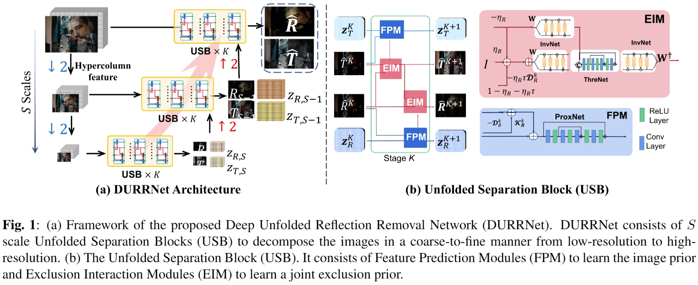

# DURRNet: Deep Unfolded Single Image Reflection Removal Network with Joint Prior
Jun-Jie Huang#(jjhuang@nudt.edu.cn), Tianrui Liu, Jingyuan Xia, Meng Wang, and Pier Luigi Dragotti

2024 IEEE International Conference on Acoustics, Speech and Signal Processing (ICASSP)


## Overview

- We propose a novel model-inspired and learning-based SIRR method called Deep Unfolded Reflection Removal Network (DURRNet). It combines the merits of both model-based and learning-based paradigms, leading to a more interpretable and effective deep architecture.
    
- We propose a model-based optimization approach and then obtain DURRNet by unfolding an iterative step into a Unfolded Separation Block (USB) based on proximal gradient descent. Key features of DURR-Net include the use of Invertible Neural Networks to impose the transform-based exclusion prior on the basis of natural image prior, as well as a coarse-to-fine architecture to fine-grain the reflection removal process.
  
- Extensive experiments on public datasets demonstrate that DURRNet achieves state-of-the-art results not only visually, quantitatively, but also effectively.




### Requisites

- Python3
- PyTorch>=1.0
- OpenCV-Python, TensorboardX, Visdom
- NVIDIA GPU+CUDA

### Dataset

We follow the synthetic data generation model of CEILNet (https://github.com/fqnchina/CEILNet) and synthetic dataset (https://github.com/ceciliavision/perceptual-reflection-removal) contains 13700 pairs of indoor and outdoor images. The real datasets consist of Real89 (https://github.com/ceciliavision/perceptual-reflection-removal) which contains 89 aligned transmission and blended image pairs. All the datasets are publicly available.


### Run DURRNet
- Training:

```
python train_sirs.py --inet durrnet --model durrnet_model_sirs --name DURRNet --hyper --if_align
```

- Testing:

```
python test_sirs.py --inet durrnet --model durrnet_model_sirs --name DURRNet --hyper --if_align --resume --icnn_path ./checkpoints/DURRNet/DURRNet_latest.pt
```

### Citation
```
@INPROCEEDINGS{DURRNet2024ICASSP,
  author={Huang, Jun-Jie and Liu, Tianrui and Xia, Jingyuan and Wang, Meng and Dragotti, Pier Luigi},
  booktitle={ICASSP 2024 - 2024 IEEE International Conference on Acoustics, Speech and Signal Processing (ICASSP)}, 
  title={DURRNET: Deep Unfolded Single Image Reflection Removal Network with Joint Prior}, 
  year={2024},
  pages={5235-5239},
  doi={10.1109/ICASSP48485.2024.10446674}}


```
